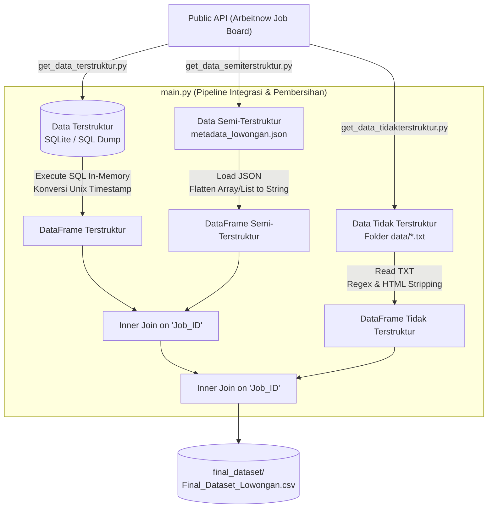

# Pipeline Integrasi Data Lowongan Kerja (Tugas Big Data)

Proyek ini merupakan implementasi pemrosesan dan integrasi data skala besar (**ETL - Extract, Transform, Load**) yang mendemonstrasikan penanganan karakteristik **Variety** dalam Big Data. Sistem ini mengambil data lowongan pekerjaan riil dari API publik, memisahkannya ke dalam tiga format data fundamental (**Terstruktur**, **Semi-Terstruktur**, dan **Tidak Terstruktur**), kemudian memproses serta menggabungkannya (*merge/join*) menjadi satu kesatuan dataset terpadu dalam format CSV.

---

## 📌 Daftar Isi
- [Latar Belakang & Konsep Big Data](#-latar-belakang--konsep-big-data)
- [Arsitektur & Alur Pipeline](#-arsitektur--alur-pipeline)
- [Struktur Direktori](#-struktur-direktori)
- [Detail Data & Sumber API](#-detail-data--sumber-api)
  - [1. Data Terstruktur (SQLite & SQL)](#1-data-terstruktur-sqlite--sql)
  - [2. Data Semi-Terstruktur (JSON)](#2-data-semi-terstruktur-json)
  - [3. Data Tidak Terstruktur (TXT)](#3-data-tidak-terstruktur-txt)
  - [4. Final Dataset (CSV)](#4-final-dataset-csv)
- [Spesifikasi Transformasi Data](#-spesifikasi-transformasi-data)
- [Panduan Menjalankan (How to Run)](#-panduan-menjalankan-how-to-run)
  - [Prasyarat](#prasyarat)
  - [Metode 1: Menggunakan `uv` (Direkomendasikan)](#metode-1-menggunakan-uv-direkomendasikan)
  - [Metode 2: Menggunakan `venv` dan `pip` Standar](#metode-2-menggunakan-venv-dan-pip-standar)
- [Langkah Eksekusi Script](#-langkah-eksekusi-script)

---

## 💡 Latar Belakang & Konsep Big Data

Salah satu tantangan utama dalam Big Data adalah **Variety** (keragaman format dan struktur data). Di dunia nyata, data jarang tersedia dalam format yang homogen. Proyek ini mensimulasikan skenario tersebut dengan:

1. **Structured Data**: Data yang memiliki skema kaku dan terdefinisi dengan baik, dapat diolah menggunakan kueri relasional (RDBMS).
2. **Semi-Structured Data**: Data yang memiliki struktur hierarkis atau label/metadata dinamis (koleksi array/list), seperti JSON.
3. **Unstructured Data**: Data teks mentah bebas tanpa format tabular atau hierarki teratur (berisi kode HTML, paragraf deskripsi pekerjaan bebas).

Pipeline ini memadukan ketiganya menjadi data terintegrasi menggunakan atribut kunci bersama (**`Job_ID`**).

---

## 🏗 Arsitektur & Alur Pipeline



---

## 📁 Struktur Direktori

```text
.
├── final_dataset/
│   └── Final_Dataset_Lowongan.csv          # Output akhir dataset terpadu
├── get_datas/
│   ├── get_data_terstruktur.py             # Script ekstraksi API -> SQLite & SQL dump
│   ├── get_data_semiterstruktur.py         # Script ekstraksi API -> File JSON
│   └── get_data_tidakterstruktur.py        # Script ekstraksi API -> Kumpulan file TXT
├── raw_dataset/
│   ├── Data_Terstruktur/
│   │   ├── lowongan.sqlite                 # File database SQLite
│   │   └── lowongan.sql                    # Script dump SQL
│   ├── Data_Semi_Terstruktur/
│   │   └── metadata_lowongan.json          # File array of objects JSON
│   └── Data_Tidak_Terstruktur/
│       └── data/                           # Direktori berisi [Job_ID].txt
├── main.py                                 # Pipeline utama pengolahan & penggabungan
├── pyproject.toml                          # Konfigurasi dependensi project (uv / pip)
├── uv.lock                                 # Lockfile dependensi yang konsisten
├── .python-version                         # Versi target Python (>= 3.13)
├── .gitignore                              # Konfigurasi ignore file git
└── README.md                               # Dokumentasi teknis proyek
```

---

## 📊 Detail Data & Sumber API

Sumber data diambil dari:
- **API**: [Arbeitnow Job Board API](https://www.arbeitnow.com/api/job-board-api) (Halaman 1 s/d 5)

### 1. Data Terstruktur (SQLite & SQL)
- **Path**: `raw_dataset/Data_Terstruktur/` (`lowongan.sqlite` dan `lowongan.sql`)
- **Tabel**: `tabel_lowongan`
- **Atribut**:
  - `Job_ID` (*TEXT, PRIMARY KEY*): Slug unik lowongan.
  - `Perusahaan` (*TEXT*): Nama entitas perusahaan.
  - `Jabatan` (*TEXT*): Posisi pekerjaan yang dibuka.
  - `Lokasi` (*TEXT*): Kota atau negara penempatan.
  - `Remote` (*BOOLEAN*): Penanda kerja jarak jauh (0/1).
  - `Tanggal_Posting` (*TEXT/INT*): Waktu posting dalam format Unix Epoch Timestamp.

### 2. Data Semi-Terstruktur (JSON)
- **Path**: `raw_dataset/Data_Semi_Terstruktur/metadata_lowongan.json`
- **Struktur**: Array of JSON objects dengan nested array.
- **Atribut**:
  - `Job_ID` (*String*): Relasi slug pekerjaan.
  - `Kebutuhan_Skill` (*List[String]*): Array tag keahlian teknis (contoh: `["Python", "SQL", "Docker"]`).
  - `Kategori_Kontrak` (*List[String]*): Array model kontrak kerja (contoh: `["Full-time", "Working student"]`).

### 3. Data Tidak Terstruktur (TXT)
- **Path**: `raw_dataset/Data_Tidak_Terstruktur/data/<Job_ID>.txt`
- **Format**: File teks mentah per lowongan pekerjaan, berisi deskripsi pekerjaan yang mencakup elemen tag HTML mentah (`<p>`, `<ul>`, `<li>`, entitas `&nbsp;`, dll.).

### 4. Final Dataset (CSV)
- **Path**: `final_dataset/Final_Dataset_Lowongan.csv`
- **Total Kolom**: 9 Atribut hasil penggabungan:
  1. `Job_ID`
  2. `Perusahaan`
  3. `Jabatan`
  4. `Lokasi`
  5. `Remote`
  6. `Tanggal_Posting` *(Telah diformat ke `YYYY-MM-DD HH:MM:SS`)*
  7. `Kebutuhan_Skill` *(Telah diratakan menjadi string dipisahkan koma)*
  8. `Kategori_Kontrak` *(Telah diratakan menjadi string dipisahkan koma)*
  9. `Deskripsi_Teks` *(Telah dibersihkan dari tag HTML dan dinormalisasi spasi/barisnya)*

---

## ⚙️ Spesifikasi Transformasi Data

Proses transformasi di [`main.py`](main.py) meliputi:
1. **HTML Stripping & Text Sanitization**:
   - `html.unescape()` untuk mengubah karakter entitas HTML (seperti `&nbsp;`, `&amp;`) menjadi karakter biasa.
   - Regex `re.sub(r'<[^>]+>', ' ', text)` untuk menghapus seluruh tag elemen HTML.
   - Regex `re.sub(r'\s+', ' ', text)` untuk meratakan baris baru, spasi berlebih, dan tab menjadi teks satu baris yang bersih.
2. **Timestamp Normalization**:
   - Fungsi `datetime.fromtimestamp()` mengonversi Unix timestamp (contoh: `1728135041`) menjadi string waktu yang dapat dibaca manusia (`YYYY-MM-DD HH:MM:SS`).
3. **Array Flattening**:
   - Mengubah tipe data array/list pada JSON `Kebutuhan_Skill` dan `Kategori_Kontrak` menjadi representasi teks (*comma-separated values*) agar kompatibel dengan format tabular CSV.
4. **Relational In-Memory Join**:
   - Melakukan `pd.merge()` bertahap dengan metode `inner join` berbasis kolom `Job_ID` sehingga hanya data yang lengkap di ketiga sumber yang masuk ke dataset akhir.

---

## 🚀 Panduan Menjalankan (How to Run)

### Prasyarat
- Python 3.10+ (Direkomendasikan Python 3.13)
- Akses internet (hanya jika ingin melakukan *crawling* ulang API via script di folder `get_datas/`)

---

### Metode 1: Menggunakan `uv` (Direkomendasikan)

Jika Anda memiliki [`uv`](https://docs.astral.sh/uv/) terpasang di sistem:

1. **Sinkronisasi dependensi virtual environment**:
   ```bash
   uv sync
   ```

2. **Jalankan pipeline integrasi data**:
   ```bash
   uv run python main.py
   ```

3. *(Opsional)* **Jika ingin mengambil ulang data dari API**:
   ```bash
   uv run python get_datas/get_data_terstruktur.py
   uv run python get_datas/get_data_semiterstruktur.py
   uv run python get_datas/get_data_tidakterstruktur.py
   ```

---

### Metode 2: Menggunakan `venv` dan `pip` Standar

Jika menggunakan instalasi standar Python tanpa `uv`:

1. **Buat dan aktifkan Virtual Environment**:
   ```bash
   # Di Linux / macOS:
   python3 -m venv .venv
   source .venv/bin/activate

   # Di Windows (Command Prompt / PowerShell):
   # python -m venv .venv
   # .venv\Scripts\activate
   ```

2. **Install dependensi yang dibutuhkan**:
   ```bash
   pip install pandas requests
   ```

3. **Jalankan pipeline ETL**:
   ```bash
   python main.py
   ```

---

## 💻 Langkah Eksekusi Script

### 1. Ingestion Data (Opsional / Jika Diperlukan Pembaruan)
Jika ingin memperbarui data mentah langsung dari sumber API Arbeitnow:
```bash
# Mengambil Data Terstruktur (menghasilkan lowongan.sqlite & lowongan.sql)
python get_datas/get_data_terstruktur.py

# Mengambil Data Semi-Terstruktur (menghasilkan metadata_lowongan.json)
python get_datas/get_data_semiterstruktur.py

# Mengambil Data Tidak Terstruktur (menghasilkan file-file .txt)
python get_datas/get_data_tidakterstruktur.py
```

### 2. Menjalankan Integrasi Utama (ETL & Merge)
Untuk memproses seluruh data mentah dan menghasilkan file akhir CSV:
```bash
python main.py
```

Output terminal yang dihasilkan:
```text
Membaca dan file TXT...
Membaca dan me-meratakan array JSON...
Menggabungkan ketiga format data (JOIN)...
SELESAI! Data berhasil disatukan dan disimpan di: final_dataset/Final_Dataset_Lowongan.csv
```

Hasil akhir dapat langsung dibuka atau dianalisis lebih lanjut pada file:
```
final_dataset/Final_Dataset_Lowongan.csv
```
